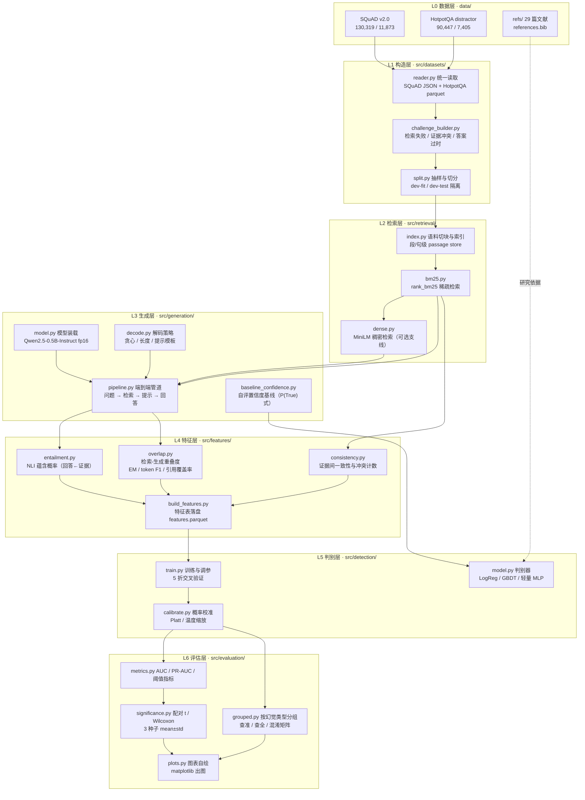
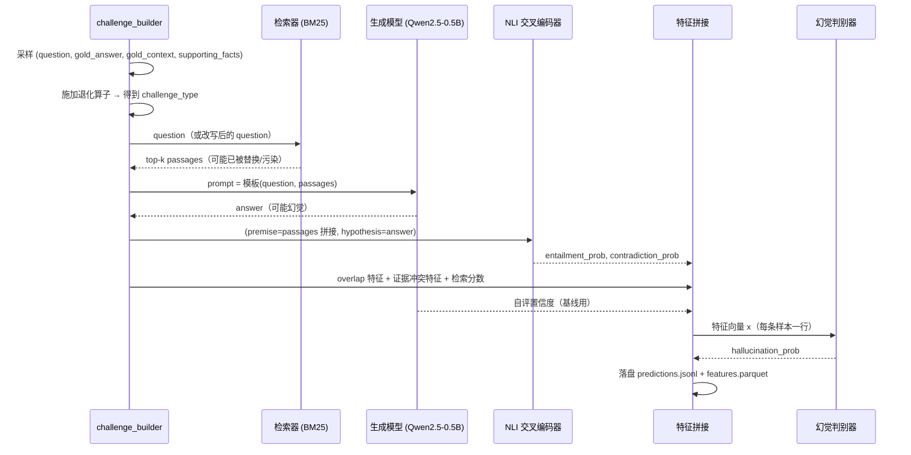
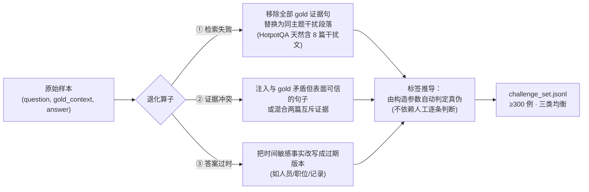
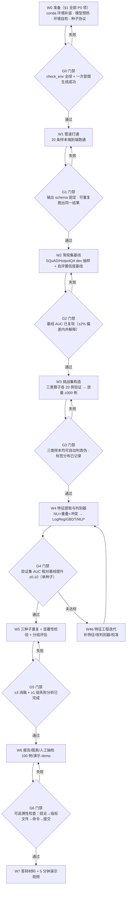
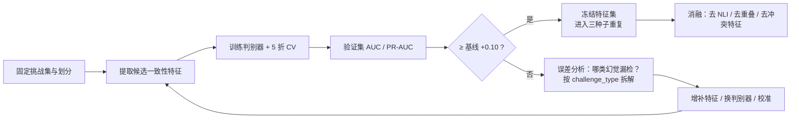
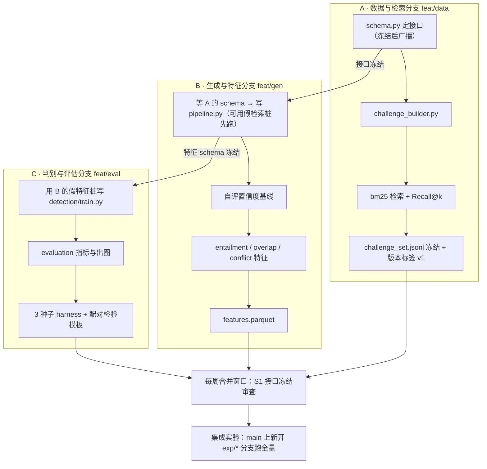

# 课题 C09 项目启动与实施指南

> 适用课题：《检索增强生成的幻觉检测与量化评估方法研究》（C09）
> 依据文档：[`C09_检索增强生成的幻觉检测与量化评估方法研究.md`](../C09_检索增强生成的幻觉检测与量化评估方法研究.md)（九要素）、[`要求.md`](../要求.md)（统一实验要求与交付物）
> 本指南第 1 节为开工准备，第 2-3 节为项目框架图与开发流程图，第 4 节为三人分工，第 5 节为验收对照表。
> 文档中所有环境数字均为**本机实测值**（实测命令见各节），非估计值。

---

## 0. 开工前的基线盘点：已有什么、缺什么

工作区 `/home/chen/文档/VsCodeDoc/RAG-C09-L` 当前已有相当完整的"数据与文献底座"，但**尚无一行实验代码、无课题专用 conda 环境**。

### 0.1 已就绪（可直接复用，不必重做）

| 资产 | 内容 | 状态与证据 |
|---|---|---|
| 数据集 | SQuAD v2.0：train 130,319 问（含不可回答 43,498）/ dev 11,873 问；HotpotQA distractor：train 90,447 / validation 7,405 | 已下载并校验，与官方发布统计一致，见 `data/raw/VERIFY.json`、`data/raw/MANIFEST.sha256` |
| 数据集字段 | HotpotQA 含 `supporting_facts`（支撑句标注）与逐篇 `context`，**可直接构造"检索失败 / 证据冲突"样本** | `data/README.md` 第 3 节 |
| 文献 | 29 篇开放获取 PDF + `references.bib` + `references.json` + 可读清单 | 元数据经"标题完全一致 + 作者姓氏有交集"双重校验；`refs/pdf/MANIFEST.sha256` |
| 脚本 | `download_data.sh`、`verify_data.py`、`download_refs.sh`、`fetch_reference_metadata.py`、`build_reference_docs.py`、**`check_env.py`**（本轮新增：环境自检） | 全部幂等，可重复执行；6 个脚本共 1138 行 |
| 综述底稿依据 | 29 篇论文摘要已抽取核对，可直接支撑 `refs/文献综述.md` | 本轮新增 |
| 算力 | RTX 3050 Laptop，**实测可用显存 3.68 GB**，torch 2.10.0+cu128、CUDA 12.8 可用（compute capability 8.6，支持 bf16） | `torch.cuda.get_device_properties(0).total_memory` 实测 |
| 磁盘 | 根分区可用约 70 GB | `df -h /` 实测 |

### 0.2 待补齐（本指南第 1 节给出做法）

| 缺口 | 影响 | 处置位置 |
|---|---|---|
| `Torch-GPU` 环境缺 `transformers`、`sentence-transformers`、`faiss`、`rank_bm25`、`pyarrow`、`datasets` 等 | 检索/生成/特征全链路不可运行 | §1.2 |
| 遗留 `.venv`（系统 Python 3.12.3 + 仅 pyarrow） | 与 conda 方案并存会造成"两套环境"混乱 | §1.1 明确废弃 |
| 无代码框架、无配置、无实验记录表 | 三人无法并行开工 | §2、§3、§4 |
| `huggingface.co` 在本机不可达 | 模型/分词器无法直接下载 | §1.3 镜像方案 |

---

## 1. 准备工作（P0 必须完成 / P1 尽快完成）

### 1.1 统一环境：conda 环境 `Torch-GPU`

**全组一律使用 conda 环境 `Torch-GPU`**（前缀 `~/miniconda3/envs/Torch-GPU`），不使用工作区遗留的 `.venv/`（系统 Python 3.12.3）。该环境的 torch 与驱动、cuDNN 已对齐且 CUDA 实测可用；重建需重新下载约 8.5 GB（CUDA 运行时占 5 GB 以上），无收益。下表均为本机实测值（2026-09-19）。

| 项 | 实测值 |
|---|---|
| 解释器 | `~/miniconda3/envs/Torch-GPU/bin/python` — Python **3.10.20** |
| 包管理 | pip **26.1.2**（`~/miniconda3/envs/Torch-GPU/bin/pip`）、conda **26.3.2**（`~/miniconda3/bin/conda`） |
| 深度学习栈 | torch **2.10.0+cu128**、torchvision 0.25.0+cu128、torchaudio 2.10.0、triton 3.6.0（均为 PyPI 安装） |
| CUDA / cuDNN | CUDA 运行时 **12.8**、cuDNN **9.10.2**、编译架构含本机 `sm_86` |
| 数值基座 | numpy **2.2.6**、pandas 2.3.3、scipy 1.15.2、scikit-learn 1.7.2 |
| GPU | 1×RTX 3050 Laptop，**可用显存 3.68 GB**，compute capability 8.6，支持 bf16（驱动 580.178.04） |
| 体积 | 8.5 GB（CUDA 运行时由 15 个 `nvidia-*-cu12` 轮子提供，约 5 GB） |
| 镜像 | pip → 阿里云（已全局配置，命令**不需要** `-i`）；conda → 清华 conda-forge |

**激活**（按场景选一条；仓库脚本与报告中的命令统一用绝对路径写法，不依赖"当前是否已激活"）：

```bash
source ~/miniconda3/etc/profile.d/conda.sh && conda activate Torch-GPU   # 交互式终端 / 脚本均可
~/miniconda3/envs/Torch-GPU/bin/python 脚本.py                            # 最稳：不依赖激活
```

**环境变量**（模型下载与离线复现，详见 §1.3）：

```bash
export HF_ENDPOINT=https://hf-mirror.com     # huggingface.co 在本机不可达
```

**四条约定**：① 禁用 `.venv/`；② 不向系统 Python 或 base 装包（`which pip` 必须指向本环境）；③ **不用 `conda install` 装 torch 三件套**（现为 PyPI 安装，覆盖会破坏 cu128 对齐）；④ 新增依赖必须刷新本节的锁定文件，并在组会报告。

**自检与复现**：

```bash
~/miniconda3/envs/Torch-GPU/bin/python scripts/check_env.py --report results/env_report.json   # 退出码须为 0
~/miniconda3/bin/conda env create -f environment.yml      # 新机器重建（同名冲突时加 -n rag-c09）
```

- `scripts/check_env.py` 校验：环境归属、Python、§1.2 的锚点版本、依赖清单、CUDA/GPU/显存、HF 镜像；补装前可加 `--allow-missing-l2` 先看缺失项；
- 锁定文件：`environment.yml`（conda 151 项 + pip 59 项，已删除 `prefix:` 行）、`requirements-lock.txt`（pip freeze 84 条）；新增依赖后刷新：
  `~/miniconda3/bin/conda env export -n Torch-GPU --no-builds | grep -v '^prefix:' > environment.yml` 与 `~/miniconda3/envs/Torch-GPU/bin/pip freeze > requirements-lock.txt`；
- 环境指纹 `results/env_report.json` 随实验记录留档（与 `seed`、`config_hash` 并列）；
- 常见问题：脚本里 `conda: command not found` → 非交互式 shell 不读 `~/.bashrc`，需显式 source；`ModuleNotFoundError` 但"明明装过" → 装到了别的环境，用 `python -c "import sys;print(sys.prefix)"` 与 `which pip` 核对；`torch.cuda.is_available()` 为 False → 确认 `torch.__version__` 带 `+cu128`；`CUDA out of memory` → 见 §6。

### 1.2 依赖清单：已具备 / 待补装

**已具备（无需处理）**，版本为本机实测。带 ★ 的为**数值锚点**，全组必须完全一致，否则组员之间的指标不可比：

| 类别 | 包与实测版本 | 一致性要求 |
|---|---|---|
| ★ 数值锚点 | torch 2.10.0+cu128、torchvision 0.25.0+cu128、torchaudio 2.10.0、triton 3.6.0、numpy 2.2.6、`nvidia-*-cu12` 全系列、cuDNN 9.10.2 | **必须完全一致**（差异会直接体现在 AUC 等指标上） |
| 统计与数据 | scikit-learn 1.7.2、scipy 1.15.2、pandas 2.3.3、PyYAML 6.0.3 | 应当一致（影响行为与 API） |
| 绘图与工具 | matplotlib 3.10.9、tqdm 4.68.3 | 应当一致 |
| 与课题无关 | black、pre_commit、virtualenv、PySide6、shiboken6、seaborn、statsmodels、tensorboard、absl-py、grpcio 等 | 允许不同，不参与结果解释 |

**待补装（课题直接依赖）**：

| 包 | 用途 | 关键约束 |
|---|---|---|
| `transformers` | 生成模型与 NLI 交叉编码器 | ≥4.56（适配 torch 2.10） |
| `sentence-transformers` | 稠密检索（可选支线，见 §2.1） | ≥3.0 |
| `datasets` | 读取 HotpotQA parquet 数据集 | ≥2.20 |
| `pyarrow` | 直接读 parquet（`verify_data.py` 已依赖） | 走 conda-forge |
| `rank_bm25` | BM25 稀疏检索（主管线，见 §2.1） | 纯 Python，无额外依赖 |
| `sentencepiece` | Qwen 系列分词器 | — |
| `accelerate` | 模型装载与设备放置 | — |
| `huggingface_hub` | 模型下载与离线缓存 | 随 `transformers` 一并安装 |
| `tabulate` | 结果表排版 | 可选 |
| `faiss-cpu` | 稠密检索索引 | 可选；≥1.9，若与 numpy 2.2.6 冲突则放弃 |

**安装命令**（镜像已全局配置：pip 走阿里云、conda 走清华，**无需 `-i`**）：

```bash
source ~/miniconda3/etc/profile.d/conda.sh && conda activate Torch-GPU

~/miniconda3/bin/conda install -y -c conda-forge pyarrow pyyaml tabulate
~/miniconda3/envs/Torch-GPU/bin/pip install "transformers>=4.56" "sentence-transformers>=3.0" \
    "datasets>=2.20" "rank_bm25>=0.2.2" sentencepiece accelerate
~/miniconda3/envs/Torch-GPU/bin/pip install "faiss-cpu>=1.9"        # 可选，冲突则跳过

# 装完立刻自检，期望退出码 0、无 missing
~/miniconda3/envs/Torch-GPU/bin/python scripts/check_env.py
```

注意事项：

- **不要加 `--upgrade`**：torch 2.10.0+cu128 是整套 CUDA 运行时的锚点，被顺带升级会破坏与驱动/cuDNN 的 12.8 对齐；
- `faiss-cpu` 若与 numpy 2.2.6 冲突，**不要降 numpy**（会连带影响 torch/scipy），改用 `sentence-transformers` 自带的内存向量检索；
- 英文分词优先用自带正则 `re.findall(r"[A-Za-z0-9]+", text.lower())`，避免 `nltk` 首次运行需联网下载 `punkt`；确需 `nltk`/`jieba` 时把数据文件随代码一并提交；
- 环境存在 conda/pip 双份安装（如 scipy 在 `conda-meta` 记 1.15.2、`pip freeze` 记 1.15.3），**实际生效版本一律以 `import` 为准**。

### 1.3 模型与镜像准备（`huggingface.co` 在本机不可达）

统一在终端或 `.envrc` 中导出（写入 README 与所有脚本头部）：

```bash
export HF_ENDPOINT=https://hf-mirror.com
export HF_HOME="$HOME/.cache/huggingface"      # 或项目外置目录，避免污染仓库
export HF_HUB_DISABLE_TELEMETRY=1
# 全部模型下载完成后，实验阶段强制离线，保证可复现
export HF_HUB_OFFLINE=1
export TRANSFORMERS_OFFLINE=1
```

**按 3.68 GB 可用显存选型**（这是本课题最硬的工程约束）：

| 角色 | 首选模型 | 体量 | 显存策略 | 许可 |
|---|---|---|---|---|
| 生成模型（主） | `Qwen2.5-0.5B-Instruct` | 约 1.0 GB (fp16) | GPU fp16，batch=1-4 | Apache-2.0 |
| 生成模型（备/对照） | `Qwen2.5-1.5B-Instruct` | 约 3.1 GB (fp16) | **必须 4-bit**（bitsandbytes NF4 ≈ 1.0 GB）或 CPU 推理 | Apache-2.0 |
| 稠密检索 | `sentence-transformers/all-MiniLM-L6-v2`（或 `BAAI/bge-small-en-v1.5`） | 约 0.09 GB | GPU 小 batch | Apache-2.0 / MIT |
| BM25 稀疏检索 | `rank_bm25.BM25Okapi`（无权重） | CPU 内存 | 纯 CPU | Apache-2.0 |
| 蕴含/NLI 判别器 | `cross-encoder/nli-deberta-v3-xsmall`（备选 `-base`） | xsmall ≈ 0.14 GB / base ≈ 0.37 GB | GPU fp16 | MIT / Apache-2.0 |

显存预算经验法则（`max_new_tokens=128`、`batch=1`、`fp16`）：**峰值显存 ≈ 权重 + 0.3 GB 激活与 KV cache**。因此 0.5B 生成 + 0.14 GB NLI 可同驻 GPU；1.5B 只能在 4-bit 下与 NLI 共存。解码统一用 `do_sample=False`（贪心），既省显存又是 3 种子复现的前提。

预热下载（一次做完，之后离线跑）：

```bash
python - <<'PY'
from huggingface_hub import snapshot_download
for repo in ["Qwen/Qwen2.5-0.5B-Instruct",
             "sentence-transformers/all-MiniLM-L6-v2",
             "cross-encoder/nli-deberta-v3-xsmall"]:
    print(repo, snapshot_download(repo))
PY
```

### 1.4 数据与文献：只需重跑校验，不需重新下载

统一使用 conda 环境的绝对路径解释器（避免依赖"当前是否已激活"）：

```bash
PY=~/miniconda3/envs/Torch-GPU/bin/python

bash scripts/download_data.sh     # 幂等：已存在且非空则跳过
$PY scripts/verify_data.py        # 校验数据集：行数/字段/分布
bash scripts/download_refs.sh     # 文献 PDF（幂等）
$PY scripts/fetch_reference_metadata.py    # 抓取文献元数据（arXiv/OpenAlex/ACL）
$PY scripts/build_reference_docs.py        # 生成 refs/references.bib 与文献清单
```

> 环境一致性：`verify_data.py` 的用法行已改为 conda 写法，仓库内不再保留 `.venv` 指引；
> 但历史产物（如 `data/raw/VERIFY.json`）是此前用 `.venv` 解释器生成的，**重新执行上述命令即可刷新**，
> 以免实验记录中出现"两套环境"的痕迹。

### 1.5 随机种子与可复现性协议（P0，验收硬指标）

课题要求"核心结论基于 ≥3 个随机种子并报告均值±标准差 + 显著性检验"，因此种子管理必须**先于**代码开发确定：

| 项 | 约定 |
|---|---|
| 主种子集合 | `SEEDS = [13, 42, 2024]`（3 个，报告中一律报 mean ± std） |
| 随机源覆盖 | `random`、`numpy.random`、`torch.manual_seed`、`torch.cuda.manual_seed_all`，以及 `transformers` 的 `set_seed` |
| 集中入口 | 唯一函数 `src/common/seeding.py::set_seed(seed)`，禁止在实验代码里散落 `np.random.seed` |
| 数据构造种子 | **独立**于模型种子（`challenge_builder` 用 `seed=1000+idx`），保证"换模型种子时挑战集不变"，消融才可比 |
| 抽样种子 | 常规测试集抽样、人工抽检 100 例的抽样，均显式传种子并记录到结果 JSON |
| 落盘留痕 | 每次实验输出 `results/metrics/<exp_id>.json`，必须含 `seed`、`config_hash`、`env`——其中 `env` 直接引用本次实验的 `results/env_report.json`（生成方式见 §1.1）；若结果最终提交到团队协作仓库，另记 `commit` |

### 1.6 工程规范

- 语言与风格：Python 3.10，`from __future__ import annotations`，模块级 docstring 必写（与本仓库既有两个脚本风格一致）；
- 配置外置：全部超参进 `configs/*.yaml`，代码里不写魔法数；`config_hash` 进结果文件；
- 日志：统一 `logging`，每次运行落 `results/logs/<exp_id>.log`；
- 第三方代码：>20 行的外部代码块必须在代码注释与报告中标注来源 + 许可证（`要求.md` 1.5 条第 2 款）。

---

## 2. 项目框架图

### 2.1 系统架构（分层）



### 2.2 一次问答样本的端到端数据流（含中间产物 schema）



中间产物字段契约（建议直接落为 `src/common/schema.py` 的 dataclass，三人依此对接，**禁止各自发明字段名**）：

```python
@dataclass(frozen=True)
class RAGSample:
    sample_id: str          # 全局唯一，如 "squad-dev-0042-c3"
    source: str             # "squad" | "hotpotqa"
    split: str              # "normal" | "challenge"
    challenge_type: str     # "none" | "retrieval_failure" | "evidence_conflict" | "outdated"
    question: str
    gold_answer: str        # 挑战样本经构造后的"真值答案"（可判定真伪）
    gold_context: list[str] # 支撑证据句
    is_hallucination: int   # 1 = 该样本下模型回答被判为幻觉（标签）

@dataclass(frozen=True)
class RetrievedPassage:
    rank: int
    title: str
    text: str
    score: float

@dataclass(frozen=True)
class Prediction:
    sample_id: str
    answer: str
    passages: list[RetrievedPassage]
    features: dict[str, float]   # entailment_prob / overlap_f1 / conflict_count / ...
    baseline_confidence: float   # 自评置信度基线
    hallucination_prob: float    # 本方法输出
```

### 2.3 挑战子集构造：三类退化算子（≥300 例）



三类算子的**可判定性**是课题成败关键，务必先在小样本（每类 20 例）上验证"真值标签能被自动推导"，再放量到 ≥300 例。

### 2.4 模块 ↔ 目录 ↔ 负责人映射

| 层 | 目录 | 负责人 | 交付物 |
|---|---|---|---|
| L1 构造层 | `src/datasets/` | A | `challenge_set.jsonl`（≥300 例）、`normal_set.jsonl`、构造日志 |
| L2 检索层 | `src/retrieval/` | A | BM25 索引、`Recall@k` 报告 |
| L3 生成层 | `src/generation/` | B | RAG 管道、自评置信度基线结果 |
| L4 特征层 | `src/features/` | B | `features.parquet`（含全部一致性特征） |
| L5 判别层 | `src/detection/` | C | 训练好的判别器 + 校准参数 |
| L6 评估层 | `src/evaluation/` | C | 指标表、分组评估、显著性报告、全部图表 |
| 公共 | `src/common/` | A（主） | `schema.py`、`seeding.py`、`io.py` — **接口以 A 为准，变更需全组确认** |

---

## 3. 开发流程图

### 3.1 主流程与阶段门禁



### 3.2 迭代循环（Phase 4 内部）



### 3.3 三人并行协作流



**并行关键**：接口（`schema.py`）与假数据桩必须在 W1 内冻结，否则三人会互相阻塞。分支与合并发生在**团队实际协作仓库**中，本工作区只承载课题文档、数据与实验产物，不使用 Git。A 冻结 schema 后，B 与 C 立刻用桩数据开工，不必等真实数据齐备。

### 3.4 周次排期（对齐教学周，开题后即执行）

```mermaid
gantt
    title C09 开发排期（W = 实验攻关期相对周次，对应教学周 6-11）
    dateFormat X
    axisFormat W%s
    section A 数据与检索
    schema 与接口冻结        :a1, 0, 1
    挑战集构造 v1（≥300例）   :a2, 1, 3
    检索器与 Recall@k        :a3, 1, 2
    挑战集版本迭代与冻结      :a4, 3, 3
    section B 生成与特征
    管道打通与冒烟测试        :b1, 0, 1
    常规集基线 + 自评置信度   :b2, 1, 2
    一致性特征提取            :b3, 2, 4
    特征工程消融              :b4, 4, 2
    section C 判别与评估
    评估框架与指标脚手架      :c1, 0, 2
    判别器训练与校准          :c2, 2, 2
    分组评估 + 3 种子 + 检验  :c3, 4, 2
    图表与报告素材            :c4, 5, 1
    section 全组
    中期检查材料（第 8 周）   :m1, 2, 1
    技术报告撰写              :m2, 6, 2
    答辩与演示                :m3, 8, 2
```



### 3.5 每周节奏

| 时点 | 动作 | 产出 |
|---|---|---|
| 周会（线上/线下 40 min） | 每人 3 分钟：上周结果（数字）→ 阻塞 → 本周计划 | 写入 `docs/实验记录.md` |
| 周中合并窗口（如周三晚） | 只合并"可运行 + 有验证"的分支；`main` 必须始终可跑通冒烟测试 | 提交记录 |
| 周会前 1 小时 | 各自在 `main` 上重跑冒烟测试，绿了才允许合并 | 冒烟测试日志 |

---

## 4. 三人团队分工

### 4.1 分工原则

1. **按"数据/管道 → 特征 → 判别评估"切分**，而非按"每人一个模型"，保证每人都能独立产出可验证的中间结果；
2. **接口所有权单一**：`src/common/schema.py` 由 A 维护，任何字段变更必须全组确认并同步改 `features.parquet` 的列说明；
3. **每人都有"可失败的实验"**：确保每人至少负责 1 组消融，天然满足"≥3 组消融"；
4. **互相审读**：报告章节交叉互审（A↔B、B↔C、C↔A），避免"自写自审"。

### 4.2 角色表

| 角色 | 代号 A —— 数据与检索 | 代号 B —— 生成与特征 | 代号 C —— 判别与评估 |
|---|---|---|---|
| **负责模块** | `src/datasets/`、`src/retrieval/`、`src/common/` | `src/generation/`、`src/features/` | `src/detection/`、`src/evaluation/` |
| **核心交付** | ① `challenge_set.jsonl` ≥300 例（三类均衡）② BM25 索引与 `Recall@k` ③ `schema.py` + 种子协议 ④ 构造参数说明文档 | ① 可复现 RAG 管道 ② 自评置信度基线结果 ③ `features.parquet`（蕴含/重叠/冲突特征全表）④ 特征定义说明 | ① 判别器（≥3 种对比）② 校准曲线 ③ 分组评估与混淆矩阵 ④ 3 种子显著性报告 ⑤ 全部图表 |
| **对应课题要素** | 数据来源、挑战子集构造 | 关键技术（RAG、NLI、一致性建模） | 实验分析、结论 |
| **主指标责任** | 挑战集标签正确性、`Recall@k` | 基线 AUC、特征可解释性 | **幻觉判别 AUC（相对基线 ≥+0.10）** |
| **消融责任** | 消融 1：三类算子分别去除/替换（看难度来源） | 消融 2：去 NLI 特征 / 去重叠特征 / 去冲突特征 | 消融 3：判别器替换（LogReg↔GBDT↔MLP）、校准影响 |
| **报告章节** | 数据与挑战集构造、检索器分析 | 方法：RAG 管道 + 一致性特征 | 实验与分析、消融与讨论、负结果分析 |
| **风险点** | 挑战样本真值无法自动判定 | 4 GB 显存下生成吞吐不足 | 训练集样本量小导致 AUC 方差大 |

### 4.3 WBS 任务分解（任务 → 负责人 → 依赖 → 验收）

| ID | 任务 | 负责 | 依赖 | 验收标准 |
|---|---|---|---|---|
| T0.1 | conda 依赖补装 + 刷新 `environment.yml` | A | — | `python scripts/check_env.py` 退出码 0（无 missing） |
| T0.2 | 模型预热下载 + 离线校验 | B | T0.1 | 断网可加载 3 个模型 |
| T0.3 | 统一 HF 镜像与离线开关（写入脚本头部与 README） | A | — | 各脚本在未联网时给出可读的镜像提示 |
| T0.4 | `schema.py` + `seeding.py` 冻结 | A | — | 三人脚本均 `import` 通过 |
| T1.1 | 数据 reader（SQuAD JSON + HotpotQA parquet） | A | T0.4 | 读取条数与 `VERIFY.json` 一致 |
| T1.2 | BM25 检索 + `Recall@k` | A | T1.1 | dev 抽样 200 问上 `Recall@5` 有报告 |
| T1.3 | RAG 管道（20 条端到端） | B | T0.4, T1.2 | 同一 seed 连续两次结果逐字节一致 |
| T2.1 | 常规集基线 + 自评置信度基线 | B | T1.3 | `baseline_metrics.json` 含 AUC |
| T2.2 | 三类退化算子原型（各 20 例） | A | T1.1 | 人工抽检 20 例标签正确率 100% |
| T3.1 | 挑战集放量 ≥300 例 + 版本冻结 | A | T2.2 | 三类各 ≥80 例，标签分布写盘 |
| T3.2 | NLI 蕴含特征 | B | T1.3 | `entailment_prob ∈ [0,1]` 分布合理，与幻觉标签负相关 |
| T3.3 | 重叠度与冲突特征 | B | T1.3 | F1/EM/冲突计数落盘，列名与 schema 一致 |
| T4.1 | 判别器训练（LogReg/GBDT/MLP） | C | T3.1, T3.3 | 5 折 CV 结果表 + 校准曲线 |
| T4.2 | 分组评估（按三类） | C | T4.1 | 每组查准/查全/混淆矩阵 |
| T5.1 | 3 种子重复 + 配对 t / Wilcoxon | C | T4.1 | `metrics.csv` 为 mean±std，p 值落盘 |
| T5.2 | 三组消融 | A/B/C | T4.1 | 每组消融有独立结果目录 |
| T5.3 | 失败分析（≥1 组未达预期） | C | T5.1 | 明确写出哪类幻觉漏检 + 原因假设 + 验证 |
| T6.1 | 人工抽检 100 例一致性核验 | A+B | T5.1 | 抽检表 + Cohen's κ 或一致率 |
| T6.2 | 图表自绘（全部用 matplotlib 由结果重绘） | C | T5.1 | `results/figures/*.png`，脚本可重跑 |
| T6.3 | 演示 demo（5 min） | B | T6.2 | 输入问题→显示证据→幻觉判定与分数 |
| T7.1 | 技术报告（5000-8000 字） | 全组 | 全部 | 含负结果分析，逐条标注引用位置 |
| T7.2 | 答辩 PPT（10 min） | 全组 | T7.1 | 三人都能讲任意一页 |

### 4.4 共同职责与轮值

- **文献**：`refs/文献综述.md` 已生成底稿，三人各认领 10 篇做精读，负责在报告"相关工作"中补充该篇的精确表述与引用位置；
- **实验记录**：`docs/实验记录.md` 由每周主持人轮值（A→B→C）；
- **冒烟测试**：谁改 `main` 谁保证冒烟测试通过，破坏者负责修（先修后议）；
- **互审**：报告每章由非作者审读并留批注，答辩前做一次完整彩排。

---

## 5. 验收对照表（`要求.md` → 本项目落实）

| 要求（2.3 节） | 本项目落实方式 | 责任 |
|---|---|---|
| ≥3 项量化指标 | ① 幻觉判别 AUC ② PR-AUC ③ 阈值下查准/查全（+ 效率：单条样本推理延迟） | C |
| 分类任务报混淆矩阵与宏/微 F1 | `evaluation/grouped.py` 输出混淆矩阵 + 宏/微 F1（挑战集正负样本需保证不极端不平衡，构造时按 1:1 控制） | C |
| ≥3 随机种子 + mean±std + 配对 t/Wilcoxon（α=0.05） | `SEEDS=[13,42,2024]`，`significance.py` 同时输出 t 与 Wilcoxon | C |
| ≥3 组消融 | ① 三类算子去除/替换 ② 特征组去除（NLI/重叠/冲突）③ 判别器替换与校准 | A/B/C |
| ≥1 组失败分析 | 预期"答案过时"类样本证据本身正确但时序错误，一致性特征天然不敏感 → 作为预设的负结果方向 | C |
| 单卡 ≤12 GB、48 h 内完成 | 实测 3.68 GB 可用显存，0.5B fp16 + 贪心解码；全量实验时间预算见 §6 | 全组 |
| 图表自绘 | `evaluation/plots.py` 全部由 `results/metrics/` 重绘，禁止截图 | C |
| 数据再构造独立完成 | 挑战集构造算子 + 参数 + 种子随代码提交到协作仓库 | A |
| 文献 ≥15 篇、近 3 年 ≥8 篇 | 已有 29 篇（按 BibTeX 年份统计，2023 年及以后 16 篇），`refs/文献综述.md` 已全部引用 | 全组 |
| GB/T 7714—2025 著录 | `references.bib` → 报告参考文献表统一转换 | 全组 |

---

## 6. 风险与备选方案

| 风险 | 触发信号 | 备选方案 |
|---|---|---|
| 显存不足导致 OOM | 生成时 `CUDA out of memory` | 降 `max_new_tokens`（128→64）→ batch=1 → 生成模型换 0.5B → 逐层 CPU 卸载；**NLI 特征改用 GPU 分批、生成与 NLI 分时复用显存** |
| 挑战集真值难以自动判定 | 20 例原型人工抽检正确率 <90% | 退化为"半自动构造 + 规则判定 + 人工确认"，并如实把人工确认比例写进报告（属于"数据构造规范"，不扣分） |
| "答案过时"类样本无可靠来源 | SQuAD/HotpotQA 中时间敏感事实稀少 | 改用 Wikipedia 修订历史/明确日期事实改写，或把此类降为探索性分析并如实报告（要求允许负结果） |
| 特征对某类幻觉无效导致 AUC 提升 <0.10 | 单种子验证集 AUC 增益 <0.05 | 增强特征（引用覆盖率、检索-生成 span 对齐、多证据投票一致性）→ 加校准 → 若仍不达标，如实报告并在结论中给出"一致性特征敏感性边界"（课题结论要求本就是这个） |
| 生成吞吐不足 | 全量推理预估 >12 h | 常规集抽样规模下调（如 500→300），先保证挑战集全量；把抽样种子与规模写进报告 |
| 环境漂移 | 组员本地包版本不同导致结果不一致 | `environment.yml` + `requirements-lock.txt` 为准，结果文件记录版本三元组 |

---

## 7. 第一步执行清单（Day 1-2 可直接照做）

```bash
cd /home/chen/文档/VsCodeDoc/RAG-C09-L
PY=~/miniconda3/envs/Torch-GPU/bin/python      # 团队统一解释器（绝对路径，不依赖激活，详见 §1.1）
PIP=~/miniconda3/envs/Torch-GPU/bin/pip

# ① 统一环境：进入 conda 环境 Torch-GPU
source ~/miniconda3/etc/profile.d/conda.sh && conda activate Torch-GPU

# ② 补装缺失依赖（镜像已全局配置，无需 -i，详见 §1.2）
~/miniconda3/bin/conda install -y -c conda-forge pyarrow pyyaml tabulate
$PIP install "transformers>=4.56" "sentence-transformers>=3.0" "datasets>=2.20" \
    "rank_bm25>=0.2.2" "sentencepiece" "accelerate"

# ③ 镜像与离线开关（详见 §1.3）
export HF_ENDPOINT=https://hf-mirror.com

# ④ 环境自检：退出码必须为 0 才继续（详见 §1.1）
$PY scripts/check_env.py --report results/env_report.json

# ⑤ 数据与文献校验（幂等，可重跑）
bash scripts/download_data.sh && $PY scripts/verify_data.py

# ⑥ 模型预热（首次需联网，之后离线）
$PY - <<'PY'
from huggingface_hub import snapshot_download
for r in ["Qwen/Qwen2.5-0.5B-Instruct",
          "sentence-transformers/all-MiniLM-L6-v2",
          "cross-encoder/nli-deberta-v3-xsmall"]:
    print(r, snapshot_download(r))
PY

# ⑦ 刷新锁定文件并落目录骨架（对应 §2.4）
~/miniconda3/bin/conda env export -n Torch-GPU --no-builds | grep -v '^prefix:' > environment.yml
$PIP freeze > requirements-lock.txt
mkdir -p src/{common,datasets,retrieval,generation,features,detection,evaluation} configs results/{metrics,logs,figures} data/{interim,processed}
```

完成后即可进入 §3.1 的 **G0 门禁**：环境自检全绿 + 20 条样本冒烟生成成功。
